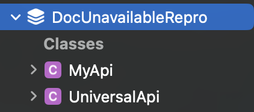
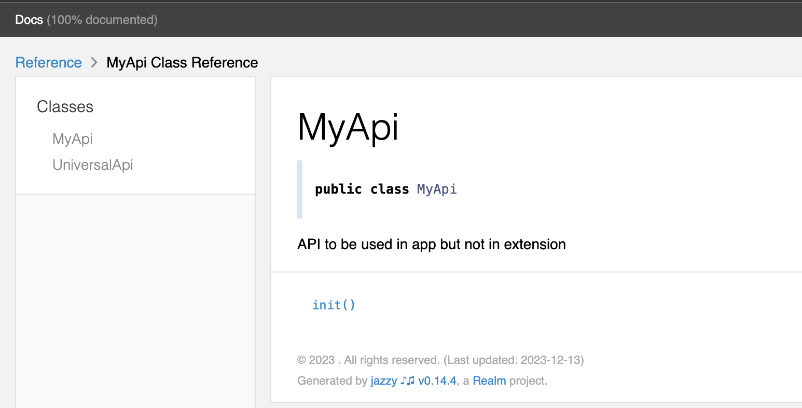
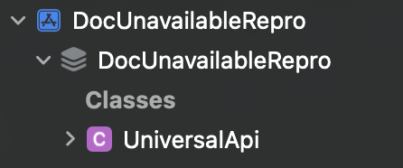
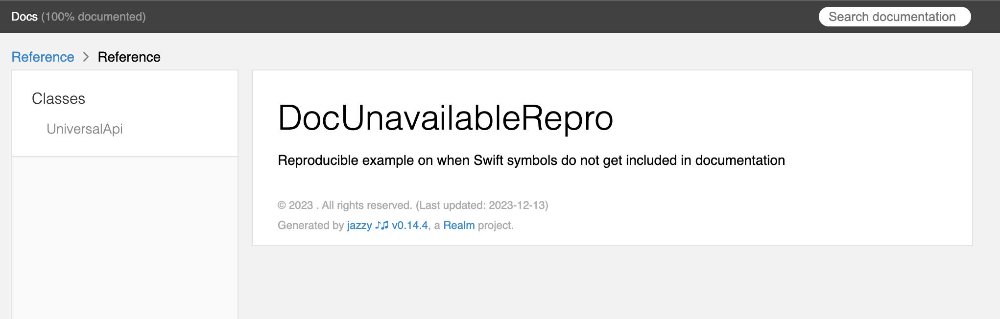

# DocUnavailableRepro
Reproducible example on when Swift symbols do not get included in documentation

```swift
@available(iOS 15.0, *)
@available(iOSApplicationExtension, unavailable)
/// API to be used in app but not in extension
public class MyApi {...}
```

in an iOS framework gets included in documentation output from Jazzy and Swift DocC when Build Setting `APPLICATION_EXTENSION_API_ONLY = NO;`




The symbol gets NOT included in documentation output from Jazzy and Swift DocC when Build Setting `APPLICATION_EXTENSION_API_ONLY = YES;`




Tested with Jazzy 0.14.4 and DocC bundled with Xcode 15.1 Beta 3
